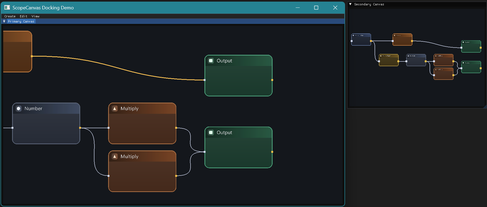
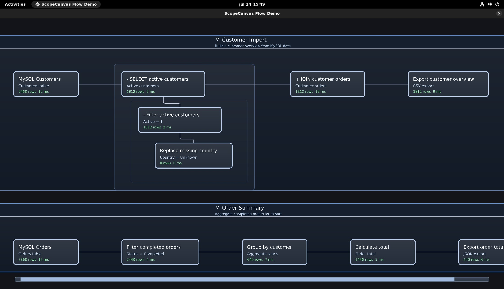

# ScopeCanvas

ScopeCanvas is a lightweight GPU-accelerated canvas engine for building node-based editors, visual tools, and interactive diagram applications.

It started as a project I've wanted to build for years, a reusable canvas and viewport framework that future projects can build upon without having to solve rendering, camera management, viewport management, and interaction handling over and over again.

The engine focuses on rendering and interaction. Applications remain responsible for their own document model, node logic, widgets, and behavior.




Typical use cases include:

- Node editors
- Visual scripting
- Data-flow pipelines
- Diagram editors
- UML tools
- Custom engineering applications

---

## Current Features

- GPU-accelerated canvas rendering
- Multi-viewport architecture
- Shared DrawContext model
- Camera and viewport management
- Input event routing
- Extensible interaction framework
- Custom rendering contexts
- OpenGL renderer
- GLFW integration
- ImGui demo application
- Modern C++20 API

---

## Planned

- Node grouping
- Hierarchical graphs
- Large graph optimization
- Undo / redo framework
- Serialization support
- Additional rendering backends
- C API for language bindings

---

## Tech Stack

- C++20
- OpenGL
- GLFW
- GLM
- Dear ImGui (demo)
- CMake

---

## Supported Platforms

| Platform | Compiler | Status |
|----------|----------|--------|
| Windows | Visual Studio 2026 (MSVC) | ✅ Supported |
| Linux (Ubuntu) | GCC / Clang | ✅ Supported |

---

## Building on Linux (Ubuntu)

### Install dependencies

```bash
sudo apt update

sudo apt install \
    build-essential \
    cmake \
    ninja-build \
    git \
    gdb \
    clang \
    clang-format \
    pkg-config \
    libx11-dev \
    libxrandr-dev \
    libxinerama-dev \
    libxcursor-dev \
    libxi-dev \
    libgl1-mesa-dev \
    libglu1-mesa-dev
```

### Clone the repository

```bash
git clone https://github.com/Iso83/ScopeCanvas.git
cd ScopeCanvas
```

### Configure and build

```bash
rm -rf build

cmake -S . -B build
cmake --build build -j$(nproc)
```

---

## Building on Windows

```bash
mkdir build
cd build
cmake ..
cmake --build .
```

---

## Design Philosophy

ScopeCanvas intentionally focuses on the canvas itself.

It provides rendering, viewport management, camera control, and user interaction while remaining independent from any specific application or document model.

This separation allows applications to reuse the same rendering and interaction layer while implementing their own data structures, widgets, and business logic.

---

## Status

The core architecture of ScopeCanvas is in place and provides a solid foundation for future projects.

Development continues as the engine evolves, with new functionality added when it supports practical use cases while keeping the framework lightweight, modular, and reusable.

---

## Third-Party Libraries

ScopeCanvas builds upon several excellent open-source projects:

| Library | Purpose | License |
|---------|---------|---------|
| [GLFW](https://github.com/glfw/glfw) | Window creation and input | zlib/libpng |
| [GLM](https://github.com/g-truc/glm) | Mathematics library | MIT |
| [GLAD](https://github.com/Dav1dde/glad) | OpenGL function loader | MIT |
| [Dear ImGui](https://github.com/ocornut/imgui) | Demo UI and docking | MIT |
| [FreeType](https://freetype.org/) | Font rendering | FreeType License |
| [nlohmann/json](https://github.com/nlohmann/json) | JSON serialization | MIT |

Many thanks to the authors and contributors of these projects.

---

## License

ScopeCanvas is licensed under the MIT License.

See the [LICENSE](LICENSE) file for details.

This project includes third-party components distributed under their own respective licenses. Refer to the documentation of each library for license information.